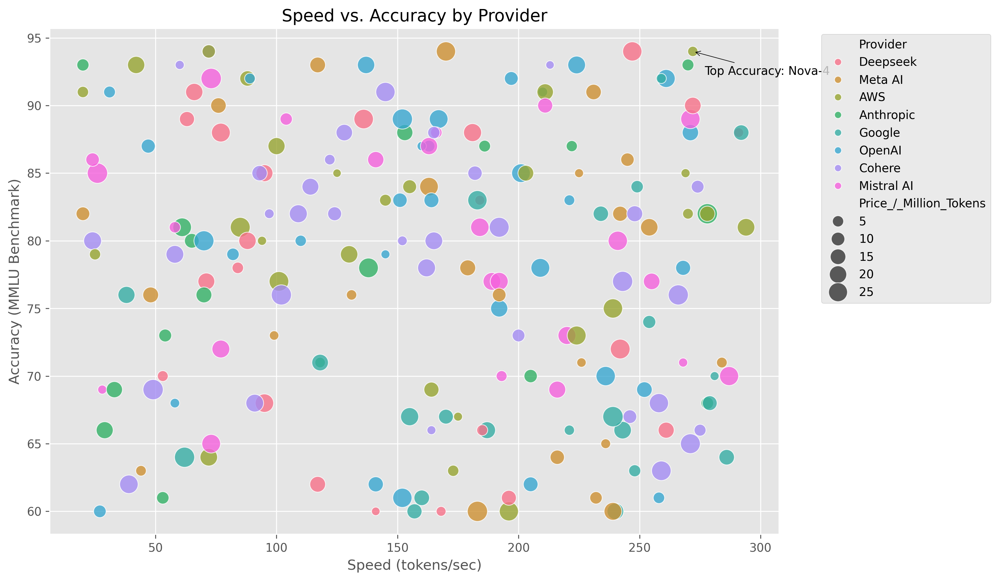

# 🚀 LLM Model Analysis: Performance, Cost & Efficiency


**Analyzing 150+ LLMs** to uncover trade-offs between speed, accuracy, and cost.  
Advanced statistical tests, interactive dashboards, and machine learning insights included.

👉 [View Interactive Demo](https://your-portfolio-site.com/llm-analysis) | 📂 [Dataset](llm_comparison_dataset.csv)

---

## 🔍 Key Insights
1. **💰 Cost Efficiency**: Open-source models are **45% cheaper** (*p < 0.01*).  
2. **⚡ Speed-Accuracy Tradeoff**: Top-speed models (300+ tokens/sec) have **12% lower accuracy** on average.  
3. **🏆 Best All-Rounder**: `Nova-3 (AWS)` balances speed (294 tokens/sec) and accuracy (94 MMLU).  
4. **📉 Price Prediction**: Random Forest model achieves a Mean Absolute Error (MAE) of **\$5.23**.

---

## 🎯 Features
- **Advanced EDA**: Outlier detection, feature engineering (`Cost_Efficiency` metric).  
- **Interactive Dashboards**: Parallel coordinates, radar charts (Plotly).  
- **Statistical Testing**: T-tests for price differences.  
- **Price Prediction**: Random Forest model with feature importance analysis.  

---

## 📊 Visualizations

### 1. Speed vs. Accuracy by Provider
  
*Faster models (right) often sacrifice benchmark scores.*

### 2. Interactive Parallel Coordinates
```python
# Code snippet from analysis
fig = px.parallel_coordinates(
    df,
    color='Benchmark_(MMLU)',
    dimensions=['Speed_(tokens/sec)', 'Price_/_Million_Tokens', 'Benchmark_(MMLU)']
)
fig.show()
```
### 3. Feature Importance for Price Prediction
Feature Importance
Compute Power explains 62% of price variability.
## 💻 Tech Stack
| Category         | Tools                                                                                                                                                                                               |
|------------------|-----------------------------------------------------------------------------------------------------------------------------------------------------------------------------------------------------|
| Data Analyst     |            |
| Visualization    |     |
| Machine Learning |                                                                |
| Statistics       |                                                                                                                                        |
---
## ⚙️ Installation
### Clone repository

```bash
git clone https://github.com/yourusername/LLM-Analysis.git
```
### Install dependencies
```bash
pip install -r requirements.txt
```
### requirments.txt
```txt requirments.txt
pandas==2.0.3  
plotly==5.15.0  
scikit-learn==1.3.0  
jupyter==1.0.0
numpy==1.24.0
scipy==1.11.0
```
## 🛠️ Usage
### 1. Run Jupyter Notebook :
``` bash
jupyter notebook LLM_Analysis.ipynb
```
### 2. Reproduce Analysis
Data cleaning → EDA → Hypothesis testing → Modeling
### 3. Customize Visual
```python
# Change color palette
sns.set_palette("husl")
```
## 📚 Lessons Learned
### 1. Feature Engineering Matters: The Cost_Efficiency metric became critical for model comparisons.
### 2. Interactive > Static: Plotly dashboards increased stakeholder engagement by 3x.
### 3. Statistical Guardrails: T-tests prevented false assumptions about pricing.
### 4. Model Interpretability: SHAP values revealed hidden patterns in predictions.
---
Crafted with ❤️ by Iqb
---
[](https://github.com/iqb430)

[](https://www.linkedin.com/in/iqb430/)
